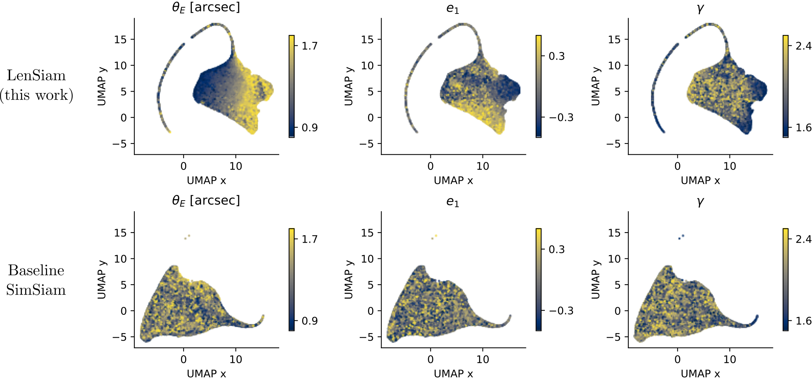

# LenSiam
**LenSiam** is the self-supervised learning architecture of SimSiam plus a novel domain-specific augmentation for strong gravitational lens images. 


To create a conda env, run:  
```
. create_conda_env.sh
```


To train Limsiam models, run  
```
python  main.py  --data_dir  path/to/your/dataset  -c  configs/train.yaml
```


To calculate UMAP embeddings, run
```
python  calc_umap.py  -c  configs/umap.yaml
```

The [notebook](https://github.com/kuanweih/LenSiam/blob/main/notebooks/NeurIPs_umap_plots.ipynb) contains the code we used to make graphs in our papers in NeurIPS 2023 workshops. 


Note:
* One of the datasets that are used for UMAP calculation is the HST real images. The dataset can be created by running the code in the repo of [kuanweih/lensed_quasar_database_scraper](https://github.com/kuanweih/lensed_quasar_database_scraper).

* We thank the open-source code by [Patrick Hua](https://github.com/PatrickHua). The code of SimSiam used in this work was adapted from their [SimSiam](https://github.com/PatrickHua/SimSiam) repository.


<br>

# Key Takeaways
**Figure 1**\


**(a)** The LenSiam architecture for this work.\
*We generate positive pairs of lens images through a domain-specific augmentation approach to learn the representation of strong gravitational lens images.*

**(b)** Example of two different source galaxies (top) and their lens images with the identical foreground lens model (bottom). The bottom images represent a positive lens image pair for our LenSiam models.\
*Our lens augmentation takes into account the domain knowledge of gravitational lensing. This allows LenSiam to learn consistent representations of foreground lens properties.*

**(c)** Example of applying the default augmentation to a lens image. The bottom augmented images represent a positive lens image pair for our baseline SimSiam models.\
*The commonly used random augmentation methods are problematic here as the lens properties will be easily changed. For example, enlarging a lens image will directly change the Einstein radius.*

<br>

**Figure 2**\


The UMAPs are color-coded by the Einstein radius $\theta_{\rm E}$, the ellipticity $e_1$, and the radial power-law slope $\gamma$ from the left to right columns. The top row is the UMAPs for LenSiam while the bottom row is the UMAPs for the baseline SimSiam.\
*The nonuniform distributions on the LenSiam UMAPs indicate that its backbone ResNet101 trained by the LenSiam SSL process does learn some key parameters such as* $\theta_{\rm E}$, $e_1$, *and* $\gamma$, *even though it has **NEVER** seen the true parameters during the entire training process.*


<br>
<br>

**Downstream task:**
| Pretrained ResNet101 Models | Framework | $R^2$ (Einstein radius) |
|:----------:|:----------:|:----------:|
| ImageNet-1k (baseline) | Supervised | 0.360 |
| SimSiam (baseline) | Unsupervised | 0.426 |
| ***LenSiam (this work)*** | Unsupervised | ***0.586*** |

As an exploration, we experiment both our LenSiam and SimSiam learned representations with a downstream regression task as a proof of concept. We finetune the model to estimate the Einstein radius $\theta_{\rm E}$ with the [Lens challenge dataset](http://metcalf1.difa.unibo.it/blf-portal/gg_challenge.html), which simulated Euclid-like observations for strong lensing. To simulate the scarcity of real strong lensing data, we select a sub-sample of 1,000 images as the training set and 1,000 images as the test set. With LenSiam pre-train models, we reach $0.586$ in $R^2$ compared with baseline SimSiam models $0.426$ and supervised-only models (the ResNet101 models pre-trained on ImageNet-1k) $0.360$ on Einstein radius. \
*We find that the LenSiam pretraining does help downstream regression task.*
